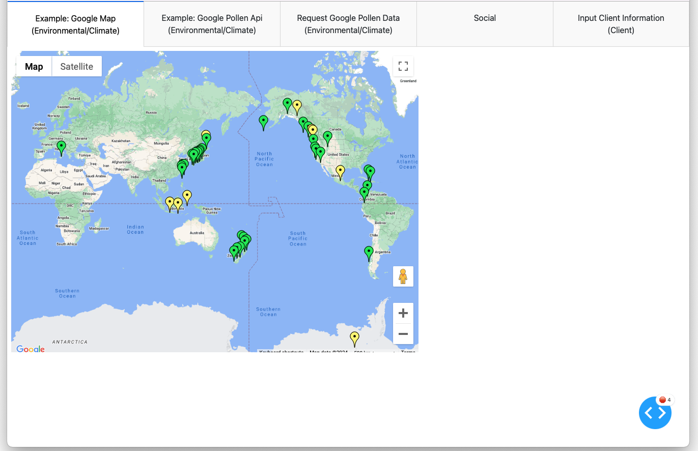
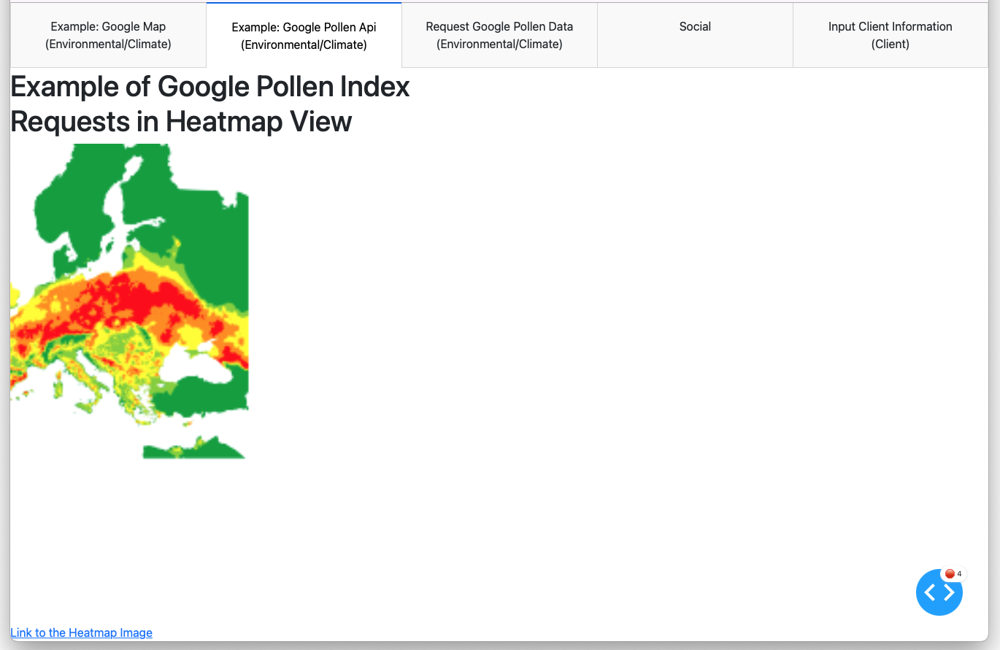
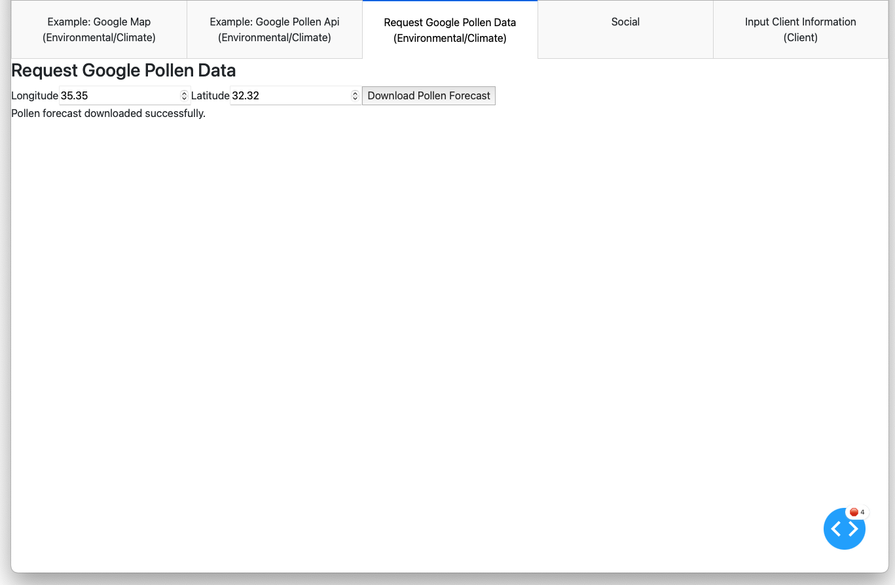
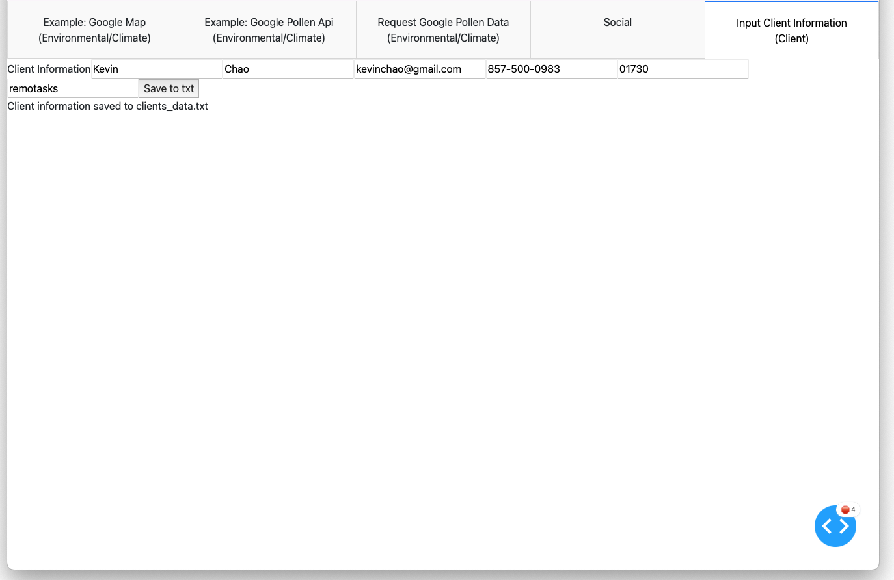

# Dashboard-Example
This is an exmaple Dashboard codes written in Python `dash` for collecting various typess of datasets, including Google Pollen index data, social media data, and client's data. 

* Created by Kevin Chao (kevinchao@gmail.com)
* https://www.linkedin.com/in/kevin-chao-com/
* Latest updated on Apr 4, 2024

* Screenshots of the Dashboard: 

* Google Map with customized locations

* Heatmap plot for Google Pollen Index: 

* Request Google Pollen Forecast data with a given location: 

* Input and collect client's information: 
